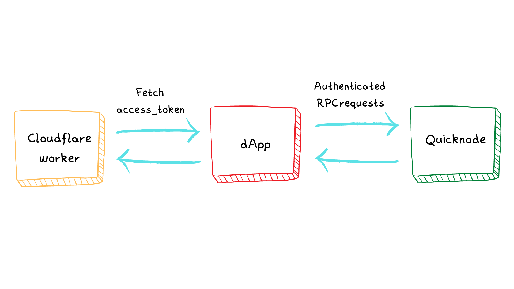
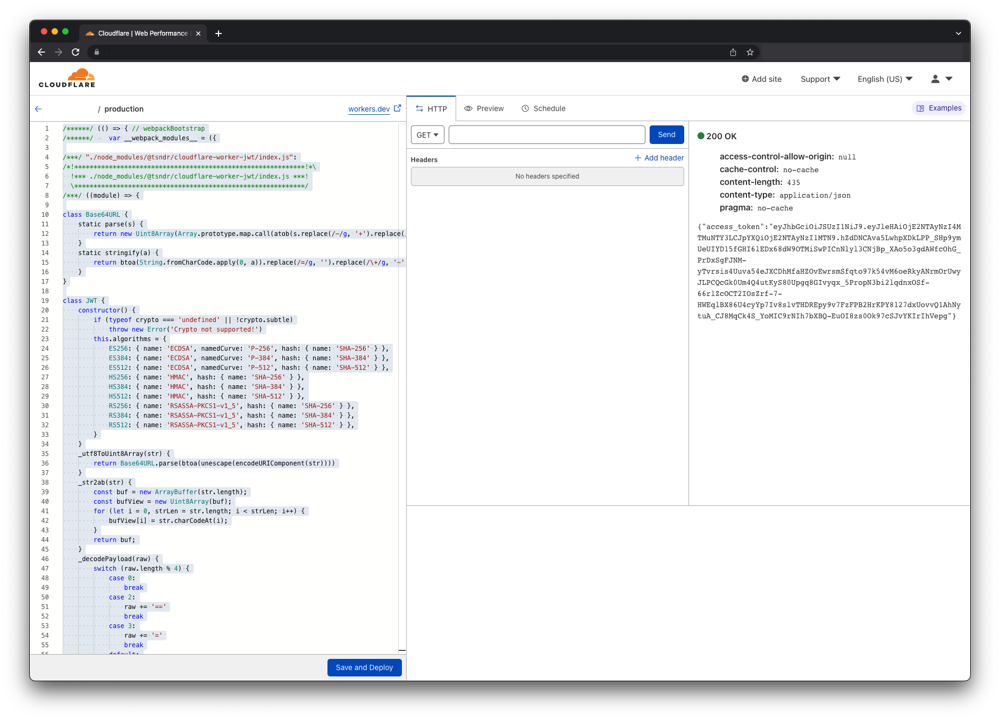

<h1 align="center">Cloudflare worker - Quicknode</h1>
<br />
<p align="center">

</p>
<p align="center">
<a href="https://twitter.com/bonfida">

</a>
</p>

<br />

<p align="center">


</p>

<p align="center">

</p>
<br/>

This tutorial explains how to use [Cloudflare workers](https://workers.cloudflare.com/) to set up [JWT authentication for Quicknode](https://www.quicknode.com/guides/knowledge-base/how-to-implement-json-web-tokens-jwt-authorization-with-quicknode).

<br />
<h2 align="center">Generate a keypair</h2>
<br />

A keypair can be generated using the following code snippet

```js
// Lifted from
// https://www.quicknode.com/guides/knowledge-base/how-to-implement-json-web-tokens-jwt-authorization-with-quicknode
const fs = require("fs");
const { generateKeyPairSync } = require("crypto");
var jwt = require("jsonwebtoken");

// Generate RSA keys
const { publicKey, privateKey } = generateKeyPairSync("rsa", {
  modulusLength: 2048,
  publicKeyEncoding: {
    type: "spki",
    format: "pem",
  },
  privateKeyEncoding: {
    type: "pkcs8",
    format: "pem",
  },
});

// Write key pairs to file
fs.writeFileSync("private_key.pem", privateKey);
console.log("Saved private_key.pem");

fs.writeFileSync("public_key.pem", publicKey);
console.log("Saved public_key.pem");
```

You will ned the `private_key.pem` file to set up your Cloudflare worker.

<br />
<h2 align="center">Cloudflare worker</h2>
<br />

<h3>
1. To get started, clone the repository and cd into it
</h3>
<br />

```
git clone git@github.com:Bonfida/quicknode-jwt-tutorial.git
cd quicknode-jwt-tutorial
yarn
```

<br />
<h3>
2. Install the wrangler CLI if you haven't already
</h3>
<br />

```
cargo install wrangler
```

<br />
<h3>
3. Add your secret key to your worker's secret environment variables:
</h3>
<br />

```
cat /path/to/private_key.pem | wrangler secret put SECRET
```

<br />
<h3>
4. Customization
</h3>

- Adapt the response headers to your production requirements
- The TTL of the JWT is set to 5 minutes, you can change it by changing the `exp` field `L65`

<br />
<h3>
5. Deploy your worker
</h3>
<br />

```
wrangler publish
```

You will find the worker in your Cloudflare dashboard and can test it using the `Quick edit` feature

<p align="center">

</p>

Now that your Cloudflare worker is published you will need to:

1. Add your public key to your Quicknode dashboard: explanation can be found [here](https://www.quicknode.com/guides/knowledge-base/how-to-implement-json-web-tokens-jwt-authorization-with-quicknode)

2. Add a middleware to your Solana dApp, we recommend using the [Strata middleware](https://github.com/StrataFoundation/strata/tree/master/packages/web3-token-auth#web3-token-auth-middleware)
